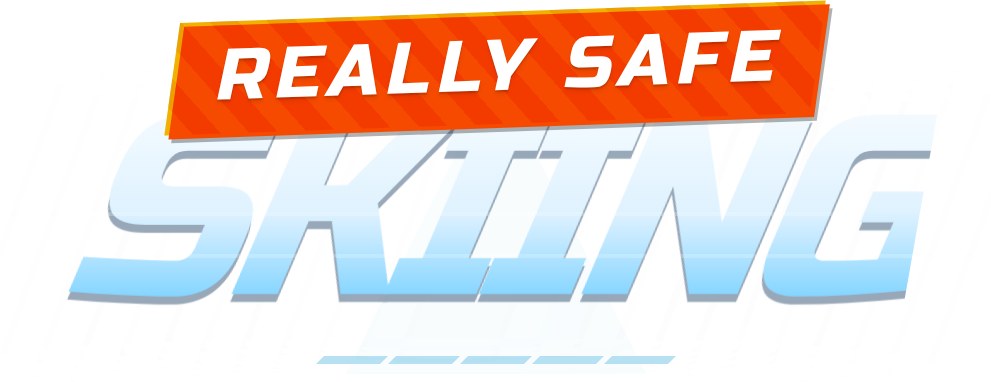

<p align="center">
  
</p>

<p align="center">
  A low-poly, high-speed downhill skiing game where safety is strictly... optional.<br/>
  Dodge trees, rocks, and gravity itself.
</p>

## ✨ Features

- **Physics-Driven Movement:** Momentum, friction, and non-linear air drag simulated via **Rapier3D**.
- **Infinite Terrain:** Procedurally generated chunks with adaptive obstacles, jumps, and cliffs.
- **Responsive Controls:** Precise keyboard steering for desktop and intuitive touch zones for mobile.

## 🎮 Game Modes

### 🔥 Sprint

**Race against the clock.** Reach the 2000m finish line as fast as possible.

- **Rules:** Crashing doesn't end the run, but adds a **+20s penalty** to your final time.
- **Goal:** Set a new Personal Best (PB) and achieve an 'S' rank by optimizing your line.

### 🪙 Arcade

**Chase the High Score.** A classic survival challenge with health and scoring.

- **Scoring:** Earn points for distance, collecting **Coins**, and gaining **Airtime** (which boosts your score multiplier).
- **Health:** You start with **3 Lives**. Glancing blows chip away armor, while high-speed impacts are fatal.

### ♾️ Zen

**Endless Relaxation.** Infinite terrain with no pressure.

- **No stress:** Crashing is **disabled**.
- **Rules:** No timer, no score, no game over. Just ski forever until you decide to stop.

## 🛠️ Tech Stack

- **Runtime:** [Bun](https://bun.sh)
- **Framework:** [React](https://react.dev) + [Vite](https://vitejs.dev)
- **3D Engine:** [Three.js](https://threejs.org)
- **Physics:** [Rapier3D](https://rapier.rs)
- **Styling:** [Tailwind CSS](https://tailwindcss.com)
- **State:** [Zustand](https://github.com/pmndrs/zustand)

## 🚀 Getting Started

This project uses **Bun** for package management and script execution.

1.  **Install dependencies:**

    ```bash
    bun install
    ```

2.  **Start development server:**

    ```bash
    bun run dev
    ```

3.  **Lint & Format:**

    ```bash
    bun run lint:fix
    bun run format
    ```

## 🎮 Controls

| Action               | Keyboard               | Touch (Mobile)        |
| :------------------- | :--------------------- | :-------------------- |
| **Steer**            | `A` / `D` or `←` / `→` | Tap Left / Right side |
| **Brake (Snowplow)** | `A` + `D` or `←` + `→` | Hold both sides       |
| **Start / Select**   | `Space` / `Enter`      | Tap Button            |
| **Pause**            | `Esc`                  | Tap UI Button         |

## 📦 Build

To create a production build:

```bash
bun run build
```
